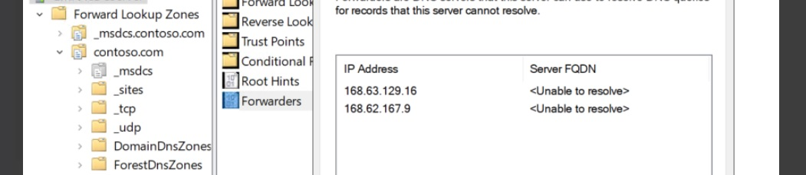

# Tutorial for Azure load balancer

## Considerations

If new VMs are created with “standard sku” for the network ip address, we can use “Load balance internet traffic to VMs”. See https://docs.microsoft.com/en-us/azure/load-balancer/tutorial-load-balancer-standard-manage-portal .

For VMs set with “Basic sku” for the network ip address, we can only use “Load balance internal traffic to VMs” for them. See https://docs.microsoft.com/en-us/azure/load-balancer/tutorial-load-balancer-basic-internal-portal .

An availability set can only be set when VM is being created.

## Set up resource group

You will want to put all your resources (virtual machine, storage, network, load balancer) in the same resources group. This is easier to manage.

## Set up virtual machines

### Public IP and public DNS name

You will want to choose "Fixed" public IP and DNS name.

Remember to choose "standard" sku for "Public IP Address". You should make sure that you choose this when you create the virtual machine. 

### Private network

Your virtual machines should be in the same private subnet. 

### Network security group

You can create 1 network security group for all virtual machines to use.  This is like a "network-level" firewall. It describes what kind of traffic can go in/out to/from your virtual machines.

### Availability zone

Do not really need to choose any availability zone. If you want, you can choose one. You can google Azure availability zone for more information.

## Set up remote connection for SQL server 

For load balancing setup, you will want to enable remote sql access for 1 SQL server on 1 of the virtual machine.

The following are the steps to enable SQL server remote connection. These are only guidelines and they should not be used for production environment.

1. Open SQL Server Management Studio

   1. Right-click on the server name to open the Properties view.
   2. In the Remote server connections section, select the Allow remote connections to this server box to enable remote connections to the SQL Server.
   3. Click on the OK button.
   4. Right-click on the server name to open the Properties view.
   5. Go to the Security section and select the SQL Server and Windows Authentication option in the Server authentication section.
   6. Click on the OK button.
   7. Go to the Security folder and right-click on the Logins sub-folder.
   8. Select the New Login option and create a new password. Remember to choose SQL Server Authentication type.
   9. Click on the OK button.
   10. To assign server roles, return to the Security folder and select the Logins sub-folder.
   11. Right-click the recently created account.
   12. Select the Properties option. This opens the Server Roles window.
   13. In the Server Roles window, assign the system administrator role to the new account.
   14. For user mapping, click on the Security folder and select the Logins sub-folder.
   15. Right-click on the recently created account and select the Properties option.
   16. In the User Mapping tab, assign the db_datareader and the db_datawriter and the public roles to the new login for all available databases.
2. Next, you need to enable the TCP/IP protocol by using a static port (the default port is 1433), instead of a dynamic port.
3. Follow these steps to enable the TCP/IP by using a static port via the SQL Server Configuration Manager: SQLServerManager13.msc (this file name may change based on SQL server version)
   1. Go to the SQL Server Network Configuration.
   2. Select the Protocols for SQLEXPRESS sub-section.
   3. Double-click on the TCP/IP option to open the TCP/IP Properties window.
   4. In the Protocol tab, select the Yes option in the Enabled field.
   5. In the IP Addresses tab, scroll down to the IPAll group and let the dynamic port empty and set the static port with value 1433.
   6. Right-click on the SQL Server (SQLEXPRESS) and select the Restart option.
   7. Modify the firewall rules to allow incoming connections in the Server. Follow these steps: https://docs.microsoft.com/en-us/sql/sql-server/install/configure-the-windows-firewall-to-allow-sql-server-access?view=sql-server-2016
   8. If need to change the remote port, check https://docs.microsoft.com/en-us/sql/database-engine/configure-windows/configure-a-server-to-listen-on-a-specific-tcp-port?view=sql-server-ver15 and https://docs.microsoft.com/en-us/sql/relational-databases/sql-server-configuration-manager?view=sql-server-ver15 .

## Set up Active directory and domain authentication

You need this if you want to test domain authentication for user login.

### Set up Domain Controller

You will need to create a separate virtual machine to be your Active Directory Domain Controller (ADDC). Do not use this machine for other purpose.

Follow "Windows Server 2019-Step by Step Installation of Domain Controller by Hussain Shakir".

In this guide:
- At DNS tool, the forwarder setup for Azure is the following
   - 
- Use the "Active Directory Users and Computers" tool to create a new domain user.

At the other virtual machine you want to join the domain
- Adjust the DNS settings for IPv4 for the network adapter to use your ADDC/DNS server's address.  For alternate DNS, use this https://docs.microsoft.com/en-us/azure/virtual-network/what-is-ip-address-168-63-129-16 for Azure. After you change it, you may loose connection to the VM's RDP. Use Azure Portal to restart the VM and then you will be able to RDP to the VM again.
- At the computer properties, you can choose to join the domain.
- Then you should log in to your other virtual machines using the domain account.

Note
- You need to start the ADDC virtual machine first before you start other virtual machines.
- For ease of RDP to virtual machine purpose, I suggest you to disable Network Level Authentication (NLA) for RDP. Google "disable NLA" to see how to do that.

### Set up Global Catalog and LDAP

Follow https://theitbros.com/global-catalog-active-directory/#:~:text=Expand%20the%20Sites%20section%20and,OK%20to%20save%20your%20changes to double check that your global catalog is enabled on your ADDC.

After that, do the following to test if it is working:
1. Go to another VM (not your ADDC) in the same domain. Install "Remote Server Administration Tools (RSAT) for Windows" (especially AD DS and AD LDS Tools). See https://docs.microsoft.com/en-us/troubleshoot/windows-server/system-management-components/remote-server-administration-tools for reference.
2. Use LDAP tool (ldp.exe) to connect and search the Global Catalog to see if you can find your users. See https://www.oreilly.com/library/view/active-directory-cookbook/0596004648/ch04s07.html for reference.

By default, the we are not using SSL.

## Set up load balancer for internet

### Overview

Check https://docs.microsoft.com/en-us/azure/load-balancer/tutorial-load-balancer-standard-manage-portal.

### SKU and IP

The SKU should be "Standard".  If the virtual machine's public ip address also has standard SKU, then we can route internet traffic.

You can find the DNS name of the LB from the LB's network asset.

### Backup pools

This should be your virtual machines.

### Health probes

This depends on your target service.

### Load balancing rules

Each rule requires 1 health probe.

## Set up load balancer for intranet

Check https://docs.microsoft.com/en-us/azure/load-balancer/tutorial-load-balancer-standard-internal-portal. In this case, the load balancer is only in your private network and it should have a private IP in your private network.

Check Installation - Windows authentication might not work to get access to PM or EMA Website using Load Balancer FQDN to consider adding load balancer into SPN.

Limitations:
- You cannot access the internal LB on any of the VM in the availability pool. Therefore, you need to use another VM not in the availability pool.

## References

- https://azure.microsoft.com/en-us/pricing/details/virtual-machines/windows/
- https://azure.microsoft.com/en-us/pricing/details/storage/blobs/
- https://docs.microsoft.com/en-us/azure/load-balancer/quickstart-load-balancer-standard-public-portal?tabs=option-1-create-load-balancer-standard
- https://azure.microsoft.com/en-us/pricing/details/load-balancer/